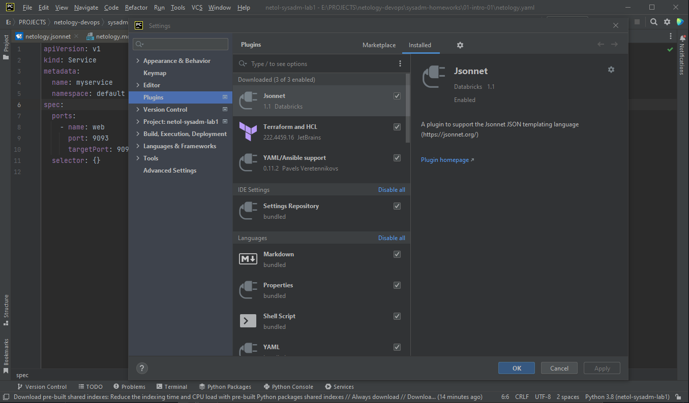
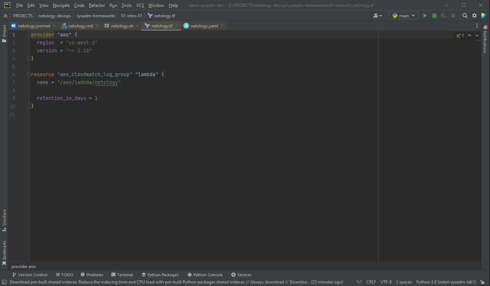
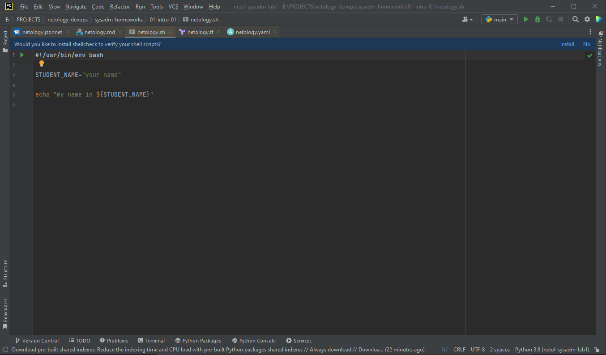
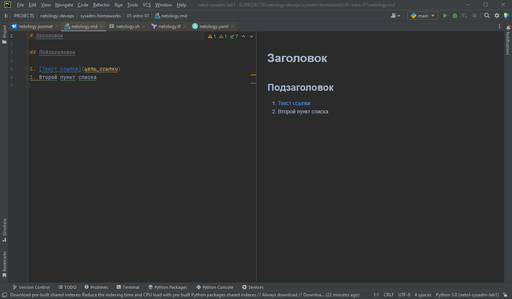
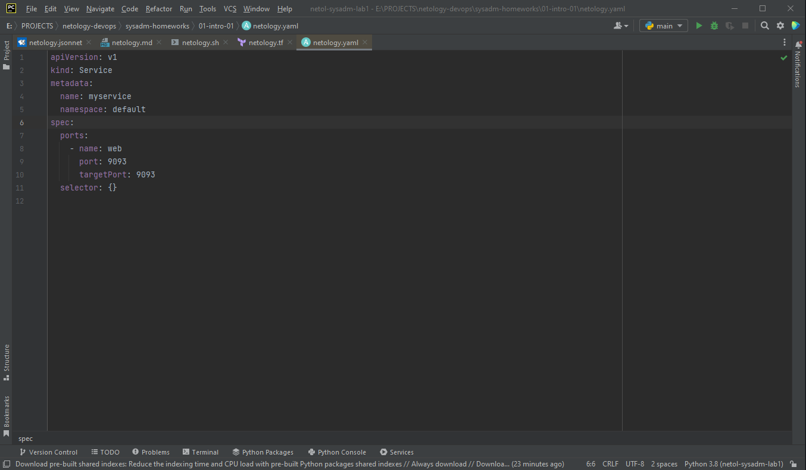
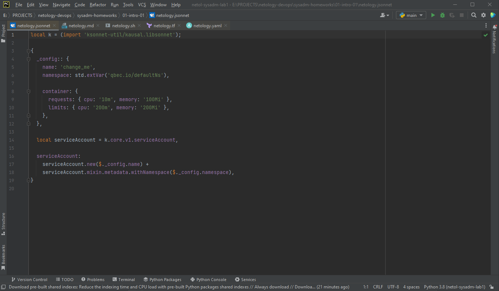

# Домашнее задание к занятию "Введение в DevOps"
## Задание 1
- PyCharm - плагины: 
- Terraform: 
- Bash: 
- Markdown: 
- Yaml: 
- Jsonnet: 

## Задание 2

1. Менеджер ставит задачу и обсждает с разработчиками и девопсом необходимые ресурсы и время для решения.
2. Разработчики выполняют изменения и пишут/изменяют соответствующие тесты, если необходимо
Девопс обспечивает работу тестов и тестовой среды в целом.
3. Готовые изменения выкатываются в тестовую среду и отдаются тестировщикам.
4. Тестировщики выполняют тестирование, и, если всё корректно, отдают задачу на приёмку менеджеру/руководителю. В случае наличия ошибок - возвращают задачу на доработку.
5. Менеджер подверждает выполнение задачи, либо отправляет её на доработку, если что-то некорректно. 
6. Девопс обеспечивает выкладку изменений на прод, мониторинг и откат изменений в случае необходимости.